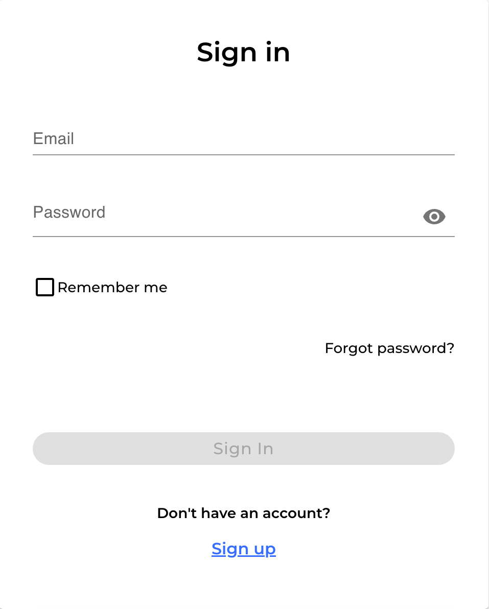
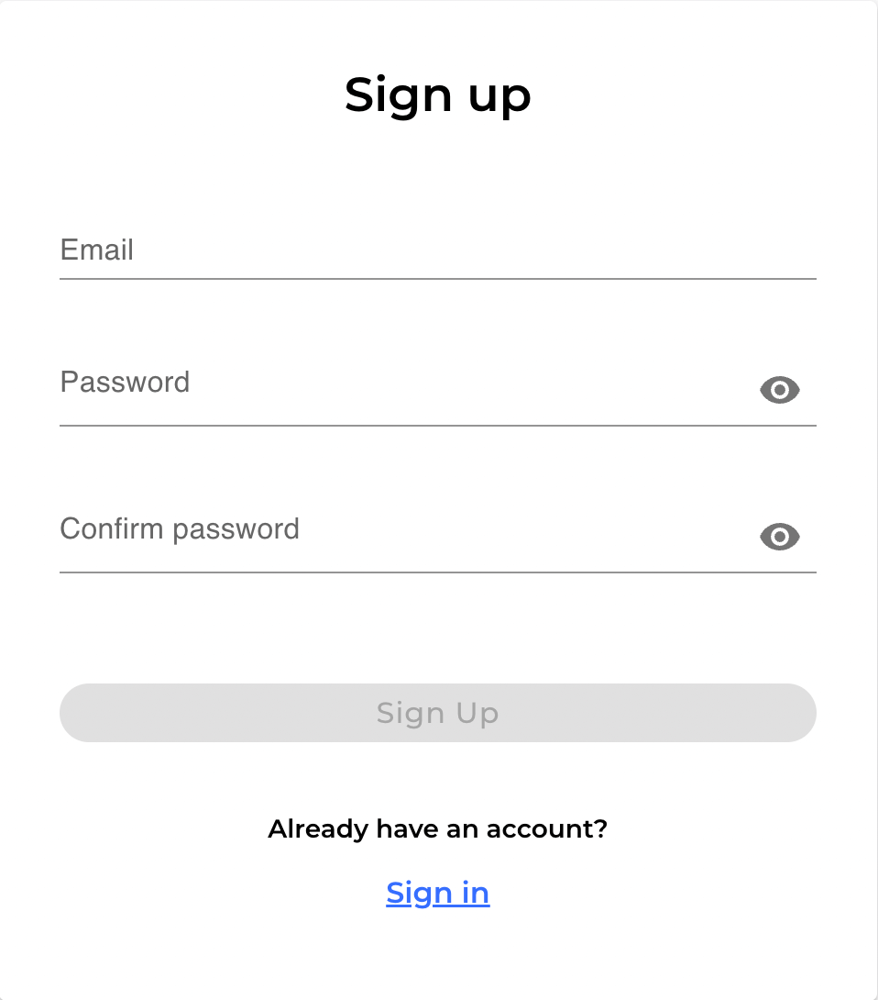
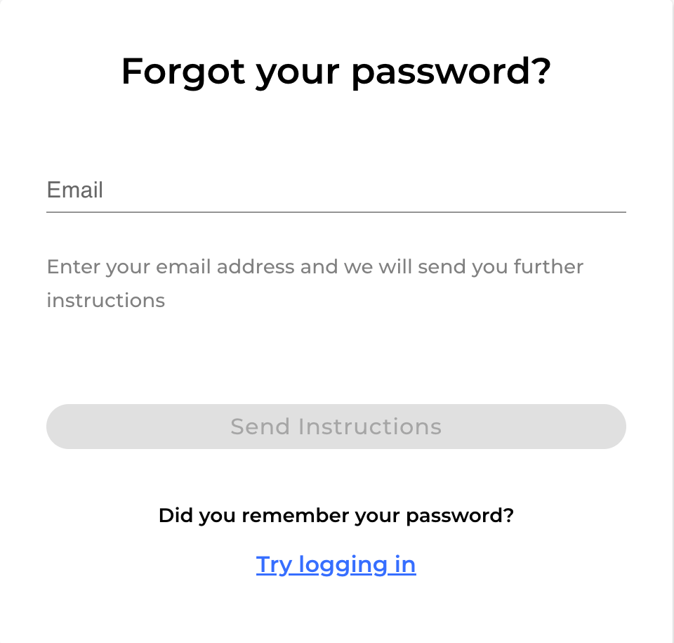
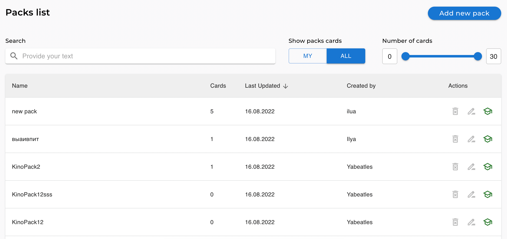
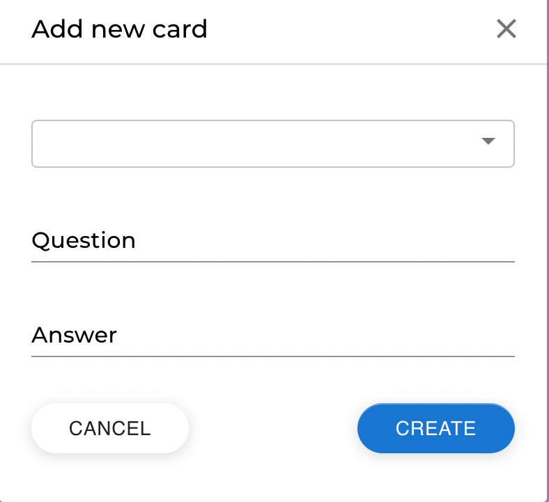
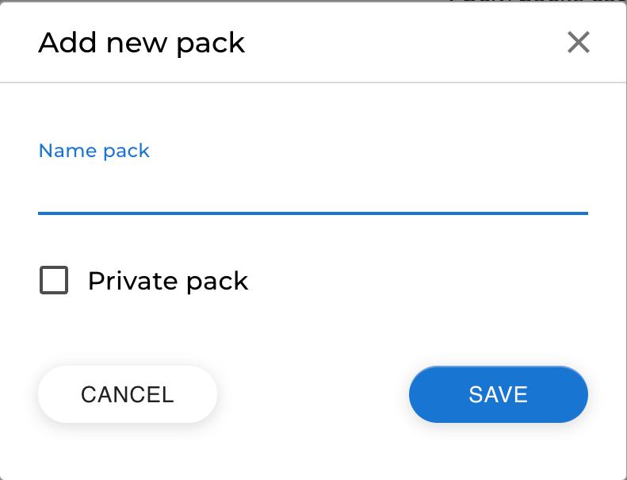
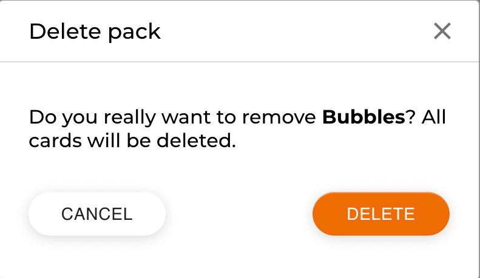

## Learning cards

### Developers:

- Alexei Boiko: [GitHub](https://github.com/AlexNewHere) [LinkedIn](https://www.linkedin.com/in/alexboiko/)
- Anton Rybakou: [GitHub](https://github.com/ToshaBY) [LinkedIn](https://www.linkedin.com/in/antonrybakov/)
- Evgeny Sychev: [GitHub](https://github.com/EvgenySychev) [LinkedIn](https://www.linkedin.com/in/evgeny-sychev-699a86248/)

### Project:

This project is about learning (flash) cards. You can add, delete or edit a pack of cards.
In this pack you can add/delete/edit cards, which contains questions and answers. When you
finish adding a pack you can initial a "testing" mode. You can watch/learn/search/filter
for other users packs.
Implemented full authorization: login and register user, create new password with email
notification.

### Objectives:

1. Teamwork
2. Git / GitHub

### Tools:

- Typescript
- React
- Redux / Redux thunk / Redux toolkit
- REST API / Axios
- React router dom
- Formik / yup
- Sass
- MUI
- Eslint / Prettier

### Screenshots:

